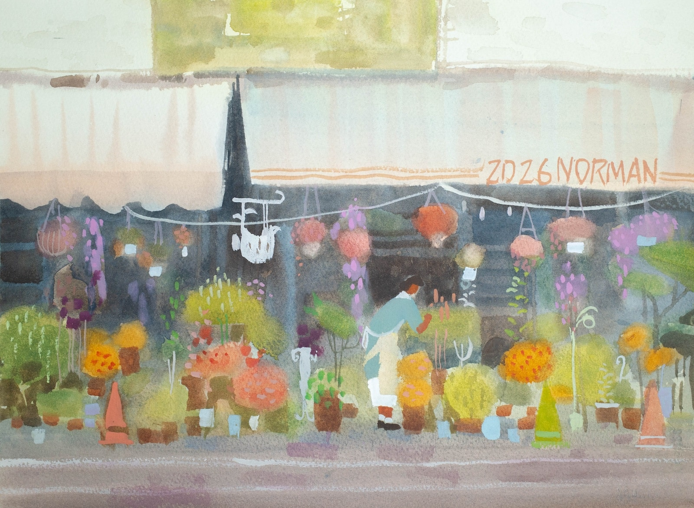

三月底與畫友邀約一起前往高雄三日的旅繪、高雄給人就是一種吊嘎與短褲必備的印象、果不其然才快清明， 
一踏出左營高鐵、那不安份的夏至節氣提早撲面而來。 
幸好這次寫生的地點都有地方可以遮陽，不然可能會曬到中暑。 
也非常感激高雄的老師與好友帶著我到處寫生，到處吃，蠻開心的一次旅繪。 

 

[充滿回憶感的永富大旅社](https://maps.app.goo.gl/gMWQq7DcujNXrGDTA)

 

 

[雨天路上的花店](https://maps.app.goo.gl/VRjvKV5gvJ1TaXEeA)

 

[中都濕地公園](https://maps.app.goo.gl/YyPjoKXdttpUEL4u5)

 

